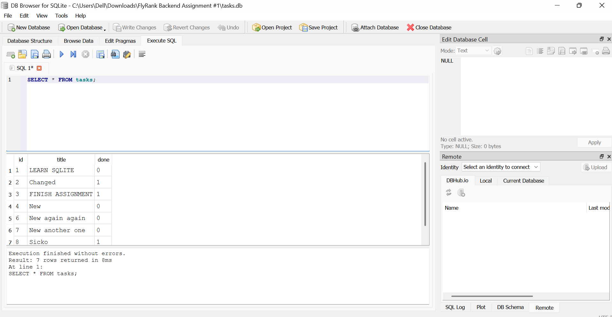

# FlyRank Backend Assignment #A2

## What is this?

A simple REST API built with FastAPI that performs CRUD operations on tasks.

---

## Why SQLite?

SQLite was chosen for this assignment because it's a lightweight, file-based database that requires no separate server process or setup — it ships with Python's standard library (via the `sqlite3` module) and works out of the box. For a small CRUD API like this, it avoids the overhead of installing and configuring a full database server (like PostgreSQL or MySQL) while still supporting real SQL queries, transactions, and constraints. It's also easy to inspect and debug with a GUI tool like DB Browser for SQLite, and the entire database lives in a single portable `.db` file, which makes it simple to version, share, or reset during development.

---

## Where the database file is stored

The database is stored locally as a single file named `tasks.db` in the project's root directory (alongside `main.py`). It's created automatically the first time the app runs, and all task data persists in this file between restarts.

---

## Installation

Clone the repository

```bash
git clone <repository-url>
```

Install dependencies

```bash
pip install fastapi uvicorn
```

## How to start the project

Run the API from the project root:

```bash
uvicorn main:app --reload
```

Then open the interactive Swagger docs in your browser:

http://127.0.0.1:8000/docs

The server will create/connect to `tasks.db` automatically on startup.

---

## Endpoints

| Method | Endpoint | Description |
|---------|----------|-------------|
| GET | / | Root endpoint |
| GET | /health | Health check |
| GET | /tasks | Get all tasks |
| GET | /tasks/{id} | Get task by ID |
| POST | /tasks | Create task |
| PUT | /tasks/{id} | Update task |
| DELETE | /tasks/{id} | Delete task |

---

## Example curl

```bash
curl -i http://127.0.0.1:8000/tasks
```

Example Output

```
HTTP/1.1 200 OK

[
  {
    "id":1,
    "Title":"Task 1",
    "Done":true
  }
]
```

---

## Swagger UI


---

## Database viewer

Below is a screenshot of the `tasks.db` file opened in DB Browser for SQLite, showing the `tasks` table:



---

## Example SQL query

While inspecting the database directly in DB Browser for SQLite, I ran the following query to find all completed tasks:

```sql
SELECT * FROM tasks WHERE done = 1;
```

This returned 3 rows — the tasks marked as done (`Changed`, `FINISH ASSIGNMENT`, and `Sicko`).

---

## What I Learned

- Building REST APIs with FastAPI
- Designing CRUD endpoints
- Request validation with Pydantic
- Using Git to track development in stages
- Publishing projects with GitHub
- Inspecting and querying SQLite databases directly with DB Browser for SQLite
