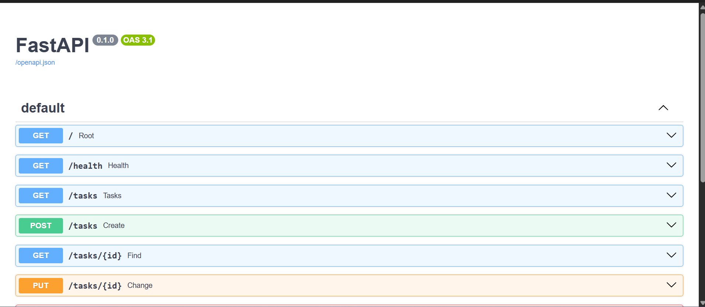

# FlyRank Backend Assignment #A2

## What is this?

A simple REST API built with FastAPI that performs CRUD operations on tasks.

---

## Installation

Clone the repository

```bash
git clone <repository-url>
```

Install dependencies

```bash
pip install fastapi uvicorn
```

Run the API

```bash
uvicorn main:app --reload
```

Open

http://127.0.0.1:8000/docs

---

## Endpoints

| Method | Endpoint | Description |
|---------|----------|-------------|
| GET | / | Root endpoint |
| GET | /health | Health check |
| GET | /tasks | Get all tasks |
| GET | /tasks/{id} | Get task by ID |
| POST | /tasks | Create task |
| PUT | /tasks/{id} | Update task |
| DELETE | /tasks/{id} | Delete task |

---

## Example curl

```bash
curl -i http://127.0.0.1:8000/tasks
```

Example Output

```
HTTP/1.1 200 OK

[
  {
    "id":1,
    "Title":"Task 1",
    "Done":true
  }
]
```

---

## Swagger UI

Paste a screenshot of

http://127.0.0.1:8000/docs

here.

```

```
## What I Learned

- Building REST APIs with FastAPI
- Designing CRUD endpoints
- Request validation with Pydantic
- Using Git to track development in stages
- Publishing projects with GitHub